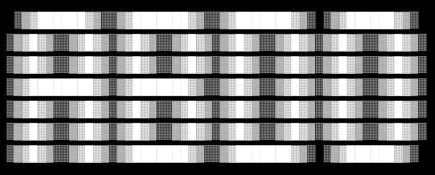

# Abdo User Guide



Abdo is your own personal task manager chatbot. Abdo has many features that allow you 
to keep track of your tasks. Features include marking as done or undone, deleting, 
finding a keyword, saving it for use during future session and even specifying the type 
of task (todo, event, or deadline).

## Listing tasks

`list` allows you to list all the created tasks and see your progress so far.
To use it, just type in the `list` command.

Example: `list`

Example output:
```
Here are the tasks in your list:
1. [D][ ] Complete CS Assignment (by: Monday 3PM)
2. [T][ ] watch Superman
3. [E][ ] F1 race (from: 9PM to: 11PM)
```


## Adding todos

`todo` allows you create a task of type todo. In order to create a deadline, you have to type in the `todo`
command followed by your task.

Example: `todo watch Superman`

Expected output:
```
Great! I added the following abdo.task to your list.
  [T][ ] watch Superman
```


## Adding deadlines

`deadline` allows you create a task of type deadline and specify
the due date. In order to create a deadline, you have to type in the `deadline`
command followed by your task, then `/by`, then the due date.

Example: `deadline Complete CS Assignment /by Monday 3PM`

Expected output:
```
Great! I added the following abdo.task to your list.
  [D][ ] Complete CS Assignment (by: Monday 3PM)
```

## Adding events

`event` allows you create a task of type event and specify
when it starts and ends. In order to create an event, you have to type in the `event`
command followed by your task, then `/from`, then the start date, then `/to`, then the end date.

Example: `event F1 race /from 9PM /to 11PM`

Expected output:
```
Great! I added the following abdo.task to your list.
  [E][ ] F1 race (from: 9PM to: 11PM)
```

## Keyword search

`find` allows you to search your tasks using a specified keyword. 
In order to search, use the `find` command, followed by the keyword
you want to find in your tasks list.

Example: `find Assignment`

Expected output:
```
Is this what you want?!?
1. [D][ ] Complete Assignment (by: Monday 3PM)
```

## Marking task as done

`mark` allows you to mark a task as completed.
In order to mark a task, use the `mark` command, followed by the index
of task you want to mark.

Example: `mark 2`

Expected output:
```
Nice job habibi! Task marked as DONE!
[T][X] watch Superman
```

## Deleting task

`delete` allows you to delete a task from the list of tasks.
In order to delete a task, use the `delete` command, followed by the index
of task you want to delete.

Example: `delete 1`

Expected output:
```
Alr, I deleted the following abdo.task from your list.
(I hope it's not because you're too lazy to do it...)
  [D][ ] Complete Assignment (by: Monday 3PM)
Now you have 2 task(s) in the list.
```

## Marking task as undone

`unmark` allows you to mark a task as not completed.
In order to unmark a task, use the `unmark` command, followed by the index
of task you want to unmark.

Example: `mark 2`

Expected output:
```
Ahhh, you're not by habibi nomo! Task marked NOT DONE!
[T][ ] Watch Superman
```

## Exiting chatbot

To exit the program after you have finished chatting with the 
chatbot, just type in the `bye` command. After the program exits,
your tasks will be saved on a `./data/tasks.txt` file.

Example: `bye`

Expected output:
```
Bye. Come back for more help ;)
```